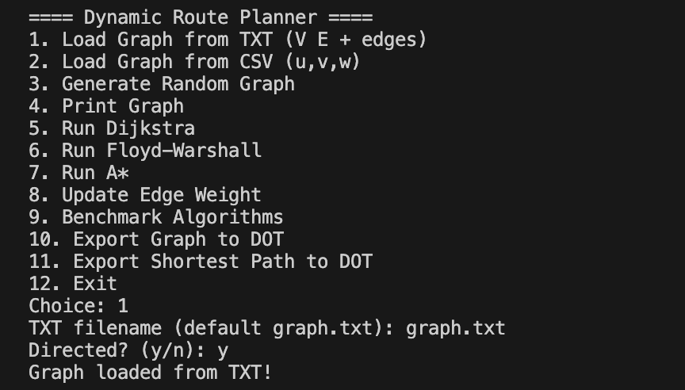
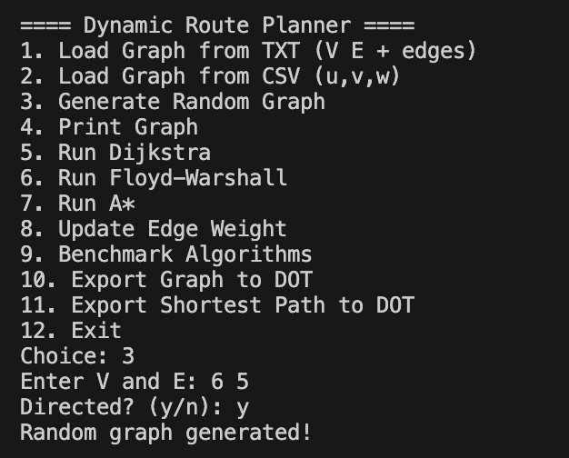
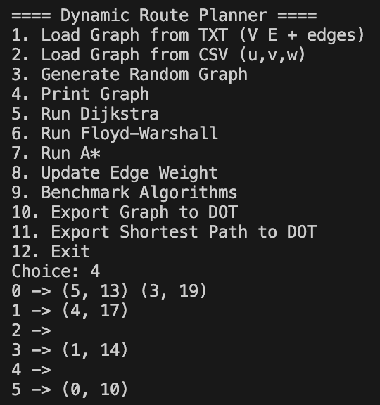
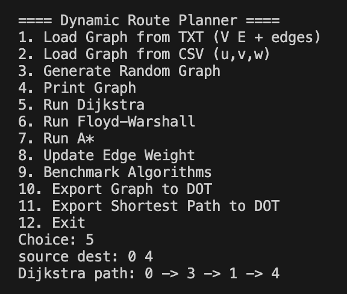
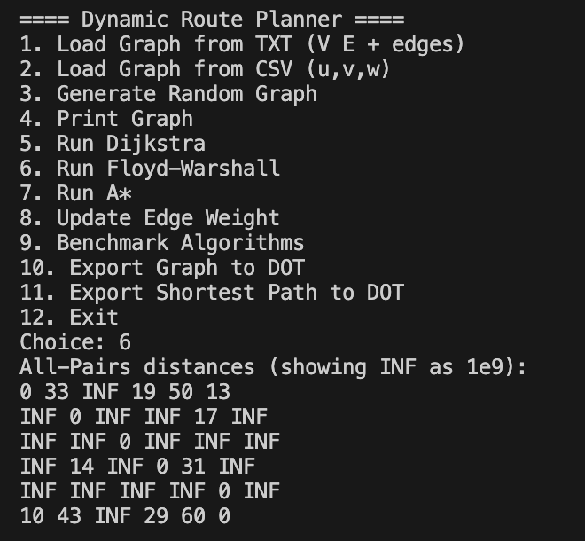
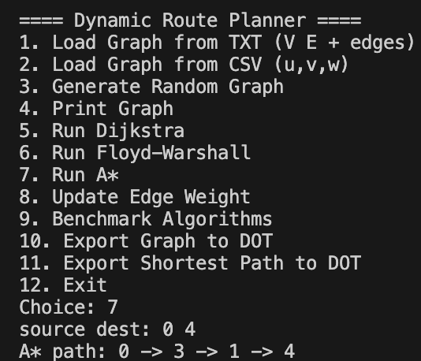
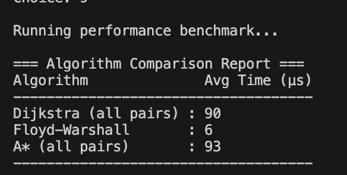
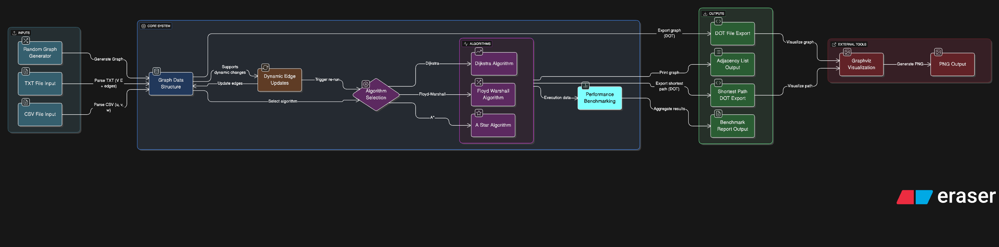

# Dynamic Route Planner

## Overview
**Dynamic Route Planner** is a C++ project that demonstrates classic graph algorithms with support for **dynamic updates**, **benchmarking**, and **visualization**.  
It is designed to showcase concepts applicable to real-world **transit systems** and **network routing**.  

The system supports multiple input formats, random graph generation, shortest path computation using different algorithms, performance analysis, and graph export for visualization.  

---

## Features

### Graph Input
- Load graphs from **TXT files** (`V E + edges` format)  
- Load graphs from **CSV files** (`u, v, w` format)  
- Generate random graphs with configurable size  

### Graph Operations
- Print adjacency list representation  
- Update edge weights dynamically to simulate real-time changes  

### Algorithms Implemented
- **Dijkstra’s Algorithm** → Single-source shortest path  
- **Floyd–Warshall Algorithm** → All-pairs shortest path  
- **A\* Search Algorithm** → Heuristic-based pathfinding  

### Performance Analysis
- Benchmark execution time of each algorithm  
- Generate a **comparative analysis table**  

### Visualization
- Export graph to **DOT format** for visualization with Graphviz  
- Export computed shortest path to DOT format (render as PNG/PDF)  

---

## Example Workflow

### 1. Load Graph


### 2. Generate Random Graph


### 3. Print Graph


### 4. Run Dijkstra


### 5. Run Floyd–Warshall


### 6. Run A\* Search


### 7. Benchmark Algorithms


### 8. System Diagram


---

## Technical Details
- **Language**: C++  
- **Libraries**: Standard Template Library (STL), `<chrono>` for benchmarking  
- **External Tools**: Graphviz (for visualization)  
- **Build**: Compatible with `g++` / `clang++`  

---

## How to Build and Run

### Compilation and Execution
```bash
g++ main.cpp graph.cpp -o planner
./planner
```

### Visualization with Graphviz
``` bash
dot -Tpng graph.dot -o graph.png
dot -Tpng sp.dot -o path.png
